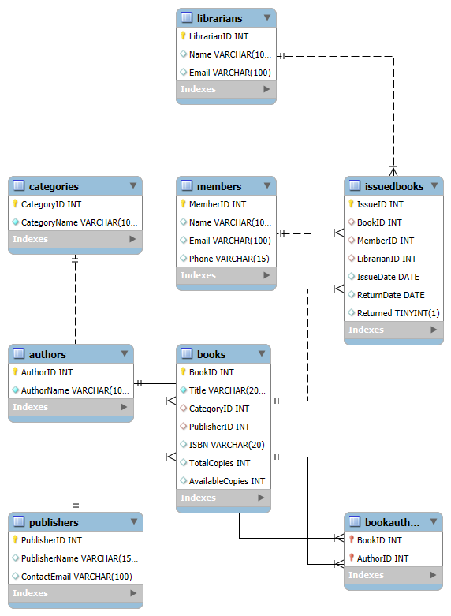

# 📚 Library Management System – Database Schema

## 💼 Internship Task 1: Database Setup and Schema Design  
**Domain**: Library  
**Tools Used**: MySQL Workbench  

---

## 🔧 Tables Created:
1. `Books`
2. `Authors`
3. `Members`
4. `IssuedBooks`
5. `Librarians`
6. `Categories`
7. `Publishers`
8. `BookAuthors` (for many-to-many relationship)

---

## 🔗 Key Relationships:
- Each book belongs to a category and a publisher.
- Books can have multiple authors (many-to-many).
- Members can issue multiple books.
- Librarians manage the issuing process.

---

## 📐 ER Diagram:

---

## 📂 Files Included:
- `schema.sql`: SQL script for creating all tables
- `ER_diagram.png`: Visual ER diagram
- `README.md`: This file

---

## 📝 Notes:
- All tables are normalized (3NF).
- Primary and Foreign Keys are implemented.
- Constraints like `UNIQUE`, `NOT NULL`, and `AUTO_INCREMENT` are used appropriately.
